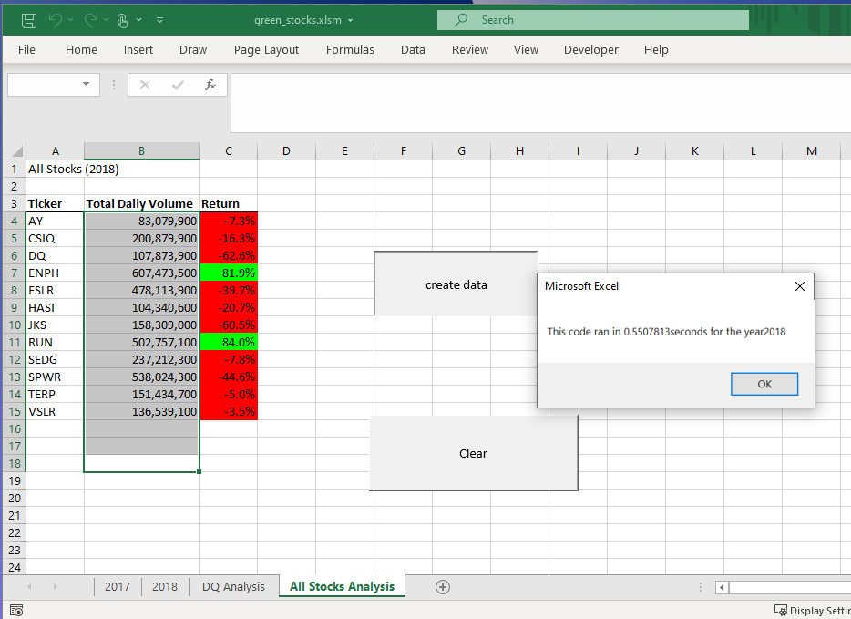

# Overview of Project
The project is using VBA to make summary table from history records in 2017 and 2018 providing total transaction volumes and return rates of 12 green energy stocks and listing by the ticker name for Steve and his parents’ reference. 
# Result
## Overview
User can click the run button in the worksheet name, All Stocks Analysis. Then there will pop up a message box asking user to enter the year they want to do analysis on. After user inputs the year, the summary table will display in the same worksheet and a pop-up message will provide the elapsed run time for the script. There are three pictures below for reference, they are pictures from refactored script in 2017 and 2018 and original script in 2018.

## Stock performance
As you can refer from the first picture, it is the summary for 2017 which shows only ticker symbol TERP’s return rate is negative and the rest of stocks are positive return rate. Ticker symbol FSLR has the highest daily volume and Ticker symbol DQ has the highest return rate, 199.4%.
However, in 2018, please see the second picture, the summary shows both ticker symbol ENPH and RUN are positive return rates, and the rest of stock are negative. ENPH’s return rate is 81.9% and has the highest daily volume among these 12 stocks.

## Execution time between original and refactored script
It spent 0.078125 seconds to get analysis done in refactored script as you can see in the first and second picture. However, it spent 0.5507813 seconds, which is six times more than refactored script, to get analysis done in original script. Please see the third picture, All Stocks (2018) in original script. 

#### Picture 1 : All Stocks (2017) summary under refactored script

#### Picture 2 : All Stocks (2018) summary under refactored script

#### Picture 3 : All Stocks (2018) summary under original script

# Summary
## Advantages and disadvantages of refactoring code in general
In general, the most advantage of refactoring code is timesaving. Since these coding lines were successfully providing result before, it is very convenience to reuse those codes since it is verified that it can bring the correct result. However, it might be at the same time more time-consuming if we do not refactor the codes in consistent or add codes in wrong order, it takes long time to debug. 

## Advantages and disadvantages of the original and refactored VBA script
The refactored VBA script runs faster than original one. This is because the original script has built a nested loop from line 48 to 86, please see the fourth picture below. Since the outer loop request to repeat 12 times, the inner loop executes from row 2 to the end row twelve times makes longer run time. On the other hand, the refactored script approaches data by looping all the rows one times, sets arrays to collect information for ending, starting and volume result and use tickerIndex to manually increase index in the array to replace nested loops, please see the fifth picture below. 
The disadvantage of refactor VBA script is that if the data is not in order, the original script can still get correct volume and the refactor script will not be able to run and provide any result at all. 

#### Picture 4 : All Stocks (2018) in original script
