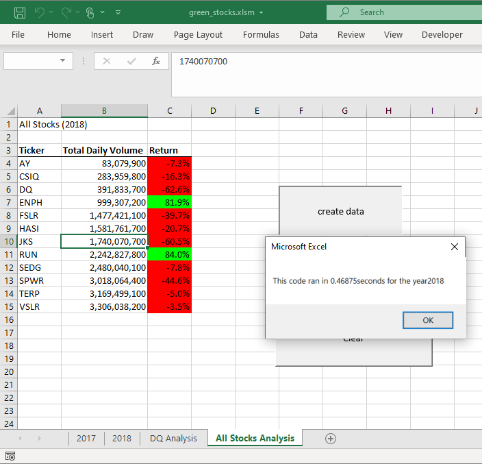

# Overview of Project
The project is using VBA to make summary table from history records in 2017 and 2018 providing total transaction volumes and return rates of 12 green energy stocks and listing by the ticker name for Steve and his parents’ reference. 
# Result
## Overview
User can click the run button in the worksheet name, All Stocks Analysis. Then there will pop up a message box asking user to enter the year they want to do analysis on. After user inputs the year, the summary table will display in the same worksheet and a pop-up message will provide the elapsed run time for the script. There are three pictures below for reference, they are pictures from refactored script in 2017 and 2018 and original script in 2018.

## Stock performance
As you can refer from the first picture, All Stocks (2017), it is the summary for 2017 which shows only ticker symbol TERP’s return rate is negative and the rest of stocks are positive return rate. Ticker symbol FSLR has the highest daily volume and Ticker symbol DQ has the highest return rate, 199.4%.
However, in 2018, please see the second picture, All Stocks (2018), the summary shows both ticker symbol ENPH and RUN are positive return rates, and the rest of stock are negative. ENPH’s return rate is 81.9% and has the highest daily volume among these 12 stocks.

## Execution time between original and refactored script
It spent 0.078125 seconds to get analysis done in refactored script as you can see in the first and second picture. However, it spent 0.46875 seconds, which is six times more than refactored script, to get analysis done in original script. Please see the third picture, All Stocks (2018) in original script. 

#### Picture 1 : All Stocks (2017)

#### Picture 2 : All Stocks (2018)

#### Picture 3 : All Stocks (2018) in original script

# Summary
